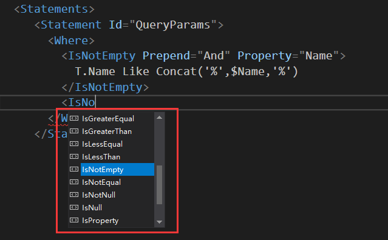

# 常见问题

## 为什么不支持 Linq?

SmartSql 希望 开发人员更多的接触 Sql ,获得绝对的控制权与安全感。所以目前没有计划支持 Code First 编程模式。
>我想好了Sql怎么写，然后再来写Linq,完了可能还要再查看一下Linq输出的Sql是什么样的，这真是糟糕的体验。要想对Sql做绝对的优化，那么开发者必须对Sql有绝对的控制权。另外Sql本身很简单，为何要增加一层翻译器呢？

> **Codefirst 一个美好，却不切实际的想法。**

## 对SmartSql很感兴趣，不只从何开始？

请阅读实例项目：<https://github.com/Ahoo-Wang/SmartSql-Starter>

## SmartSql支持哪些数据库？

支持，只要是实现了ADO.NET的数据库驱动的数据库均支持，您只需要安装好对应的驱动即可。

## SmartSql是否支持多数据库？

支持，可以通过配置引入多个数据库实例：

``` csharp
var sqlServerMapper = MapperContainer.Instance.GetSqlMapper("SmartSqlMapConfig-SqlServer.xml");
var mySqlMapepr = MapperContainer.Instance.GetSqlMapper("SmartSqlMapConfig-MySql.xml");
```

## SmartSql性能如何？

SmartSql的性能与Dapper是保存同一级别的≈原生手写（另外多个其他ORM在自己的测试报告中写明比Dapper性能还高，**请同学们保持好奇**），文档中的 SmartSql 性能对比测试报告是开放了源代码的，任何对于性能感兴趣的同学均可以clone源代码自己跑一遍性能测试。**自己Run的性能测试才是真的测试！**

## SmartSql可用性如何？

SmartSql 已历经1年多的线上数十个微服务场景验证，其性能、可用性、生产力是得到验证的。

## 对于简单CURD配置

SmartSql 提供了常规Sql操作的模板,开发人员可以直接通过模板生成Xml配置文档.

## 为什么选择Xml作为配置语法

Xml 的标签语法用起来会比较灵活. 比如 筛选标签,嵌套复用,可读性.
复杂查询场景用起来会非常舒爽,可读性也会比较好,代码层面不需要做任何处理,全部交给Xml .

## 集群场景如何使用获得缓存一致性

SmartSql提供了Redis缓存插件,可通过NuGet安装:

``` csharp
Install-Package SmartSql.Cache.Redis
```

## 集群场景中Sql配置很多Copy怎么办

SmartSql 提供了 ZooKeeper配置插件,通过NuGet安装:

``` csharp
Install-Package SmartSql.ZooKeeperConfig
```

- 另外作者还开源了ZooKeeper节点管理工具:[ZooKeeper-Admin](https://github.com/Ahoo-Wang/ZooKeeper-Admin),可直接通过该管理工具直接配置. 关于[ZooKeeper-Admin](https://github.com/Ahoo-Wang/ZooKeeper-Admin):
- 使用 Asp.net Core 编写
- Docker安装:

``` csharp
docker pull ahoowang/zookeeper.admin
docker run --name zooAdmin -p 80:80 ahoowang/zookeeper.admin
```

- 本地安装

``` csharp
git clone https://github.com/Ahoo-Wang/ZooKeeper-Admin.git
dotnet run
```

## 我之前使用过MyBatis,感觉SmartSql有种似曾相识的感觉

是的,SmartSql编程模型多处借鉴了MyBatis,如果你之前使用过MyBatis,那么SmartSql将是你更好的选择,因为你几乎不需要有任何编程方式的转变就可以直接上手,并且拥有跨平台,高性能,以及众多你插件的支持.

## 手写Xml 很痛苦是否有智能提示

SmartSql 提供了Xml架构文档,可以获得输入智能提示的体验:
